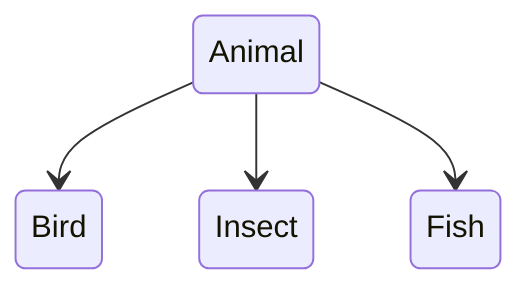

### CHAP06
**클래스**
- 클래스 : 자바의 설계도 
  인스턴스(객체) : 클래스로부터 만들어진 객체

- 특수문자 중 $, _ 만 사용가능
- 라이브러리(API) 클래스, 실행 클래스

**필드**
- 필드선언 : 클래스 내부 *생성자나 메소드 내부에서는 사용불가(로컬변수가 됨)
- 필드사용 : 클래스 내부의 생성자와 메소드에서는 바로 사용 가능 / 클래스 외부에서 사용할 경우 반드시 객체를 생성하고 참조 변수 통해 사용 (필드는 객체의 데이터!)

**생성자**
- 생성자의 블록이 성공적으로 실행된 후 객체가 생성됨.
- 기본 생성자는 클래스 선언시 자동으로 추가됨.
- `ClassName(매개변수){ }`
- 매개 변수 이름은 필드 이름과 유사하거나 동일하게! (권장)
- 필드와 매개 변수 이름이 완전히 동일하면 "this.필드"로 표현
    ```java
    public Korean(String name, String ssn){
        this.name = name;
        this.ssn = ssn;
    }
    ```
- 생성자 오버로딩 : 외부에서 제공되는 다양한 데이터를 사용하여 객체화하기 위해 (생성자 여러개 선언)
- 매개 변수의 타입, 개수, 선언된 순서 같은 경우, 매겨 변수 이름만 바꾸는 것은 생성자 오버로딩 아님.
- this() : 생성자의 첫줄에만 허용

**메소드**
- 메소드 선언부(signature) 
  - 리턴타입 : 메소드 실행후의 결과값의 타입, *없다면 void
  - 메소드 이름 : 관례적으로 소문자로 작성
  - 매개 변수 : `double divide(int x, int y)` 라면 int x 대신 byte는 들어갈 수 있지만 double은 int로 타입변환이 되지 않아서 안됨
    - 매개 변수를 모르면? 배열타입선언 OR 배열대신 ...사용
- 리턴문
  - void 선언된 메소드에서 return문을 사용하면 메소드 강제 종료
  - `return;`와 `break;`의 차이? return은 메소드를 break는 그 중괄호블록을 빠져나옴
- 메소드 호출
    - 리턴값이 없거나(void), 있어도 리턴값을 받지 않을 경우엔 타입 변수로 받아줄(`타입 변수 = 참조변수.메소드(매개값, ...)`) 필요가 없음 
- 메소드 오버로딩
  - 매개 변수의 타입, 개수, 순서 중 하나가 달라야 함

**인스턴스**
 - 인스턴스 멤버와 정적멤버
   - 인스턴스 멤버 : 객체를 생성한 후 사용할 수 있는 필드와 메소드
   - 정적 멤버 : `static` 클래스 ─[클래스 로더]─▶ 메소드 영역에 적재
   - ☞ 객체마다 다를 수 있는 필드 값은 인스턴트 필드로, 그렇지 않으면 정적 필드로 선언!
   - ☞ 메소드 블록에 인스턴스 필드 또는 인스턴스 메소드 또는 this 키워드를 사용할 경우 인스턴스 메소드로, 그렇지 않으면 정적 메소드로 선언!
   - ☞ 만약 정적 메소드에서 인스턴스 멤버를 사용하려는 경우? 객체 우선 생성 후 참조 변수로 접근
   ```java
   static void method3(){
     ClassName obj = new ClassName();
     obj.field1 = 10;
     obj.method1();
   }
   ```

- 싱글톤 : 전체 프로그램에서 단 하나의 객체만 만들도록 보장
  ```java
  //정적 필드
  private static 클래스 singleton = new 클래스();
  
  //생성자
  private 클래스(){ }

  //정적 메소드
  static 클래스 getInstance(){
    return singleton;
  }
  ```
- final 필드 
  - 인스턴스 : 생성자에서 초기화! `final 타입 필드[= 초기값];`
  - 정적 : 관례적으로 대문자로 작성! `static final 타입 상수 = 초기값;` 

**패키지선언**
- import문 
  - 사용하고자 하는 클래스 또는 인터페이스가 다른 패키지에 소속된 경우
  - 패키지 선언과 클래스 선언 사이에 작성
  - 하위 패키지는 별도로 import를 해야함 
    `import com.hankook.*;`
    `import com.hankook.project.*;`
  - 다른 패키지에 동일한 이름의 클래스가 있을 경우, import와 상관없이 클래스 <u>전체이름</u>을 기술
    - 이 때, 개별 import문은 작성하지 않아도 됨
  - `Ctrl + Shift + O`

**접근 제한자**
- public :                `public ClassName(...){...}`
- protected
- default : 같은 패키지 내 `ClassName(...){...}`
- private : 클래스 내부    `private ClassName(...){...}`  
- 접근제한자를 붙이지 않으면 default
- 자동적으로 만들어지는 기본생산자도 접근제한자가 붙음
- 클래스에는 public만 붙음

**Getter, Setter**
- 외부에서 객체에 마음대로 접근할 경우 <u>객체의 무결성</u> 깨질 수 있음. -> Field에 pirvate를 붙이고, get과 set 메소드를 이용
```java
  class Car{
    private int speed;
    private boolean stop;

    public int getSpeed(){
      return speed;
    }

    public void setSpeed(int s){
      this.speed = s;
    }
  }
  ```
- Getter 메소드
  - 외부로 필드값을 <u>전달</u>하는 것이 목적
  - 필드값을 가공해서 외부로 전달할 수 도 있음
  - boolean타입의 getter는 `get`이 아닌 `is`
  ```java
  double getSpeed(){
    double km = speed * 1.6;
    return km;
  }
  ```
- Setter 메소드 
  - 외부의 값을 받아 필드의 값을 <u>변경</u>하는 것이 목적
  - 매개값을 검증하여 유효한 값만 필드로 저장할 수 있음
  ```java
  void setSpeed(double speed){
    if(speed < 0){
      this.speed = 0;
      return; 
    } else {
      this.speed = speed;
    }
  }
  ```   

---  

### CHAP07
**상속**
- 이미 개발된 클래스를 재사용하여 중복코드와 유지보수 시간이 줄어듬
- `public class SportsCar extends Car {...}`
- 부모 클래스는 하나
- 부모 클래스에서 private 접근 제한을 갖는 필드와 메소드는 상속대상 제외
- 부모와 자식 클래스가 다른 패키지에 존재할 경우, default 접근 제한된 필드와 메소드 역시 상속 제외 
- 자식 객체를 생성할 때 부모 객체가 먼저 생성되고 자식 객체가 생성됨
  - 자식 생성자의 맨 첫줄에서 부모 생성자가 호출됨 `super();`
  - 부모 생성자를 호출 할 때 매개변수가 있으면 `super(a,b);`

**다형성**
- 다형성 :  메소드 재정의[Override] + 타입변환
- 클래스 타입 변환 : 다른 클래스 타입으로 객체를 대입
- 자동 타입 변환 : 부모타입 변수 = 자식타입;
  - 바로 위 부모가 아니더라도 상속 계층에서 상위 타입이면 자동 타입 변환
  - 부모타입으로 자동변환 이후에는 부모클래스에 선언된 필드 및 메소드만 접근 가능
  - 예외적으로, 메소드가 자식 클래스에서 재정의될 경우 자식 클래스의 메소드가 대신 호출
- 강제 타입 변환 : 자식타입 변수 = **(자식타입)** 부모타입;
  - 조건 : 자식 타입이 부모 타입으로 자동 타입 변환한 후 다시 반대로 변환할 때 사용
  - `Parent parent = new Child();`
  - `Child child = (Child) parent;`
  - 메소드 내 강제 타입 변환이 필요한 경우, instanceof 연산자로 확인 후 안전하게 실행
    - `boolean result = 좌항(객체) instanceof 우항(타입)`
    - 타입을 확인하지 않으면 ClassCastException 발생가능
- 필드의 다형성
  ```java
  class Car {
    //Field
    Tire frontLeftTire = new Tire(); 
    Tire frontRightTrie = new Tire();
    Tire backLeftTire = new Tire();
    Tire backRightTire = new Tire();
  }
    //Method
    void run(){}
  ```
  ```java
  Car myCar = new Car();
  myCar.frontRightTire = new HankookTire();
  myCar.run(); 
  ```
- 매개변수의 다형성
  - 매개변수에 객체를 줄 수 있음

**추상 클래스**

- 실체 클래스의 설계 규격 - 객체생성용 아님! (실체 클래스에 반드시 존재해야할 필드와 메소드의 선언)
- 추상 클래스와 실체 클래스는 부모-자식 클래스로서 상속 관계를 가짐  
- 실체 클래스에는 공통된 내용은 빠르게 물려받고, 다른 점만 선언하면 되므로 시간 절약
- `public abstract class 클래스{}`
- 추상 클래스도 생성자를 갖지만 직접 객체를 생성할 수 없음. 자식 생성자에서 super(...) 형태로만 추상 클래스의 생성자 호출
- 추상 메소드 
  - `[public | protected] abstract 리턴타입 메소드이름(매개변수);`
  - abstract 키워드로  선언되고 중괄호가 없는 메소드
  - 하위 클래스는 반드시 재정의해서 실행 내용을 채워야 함
